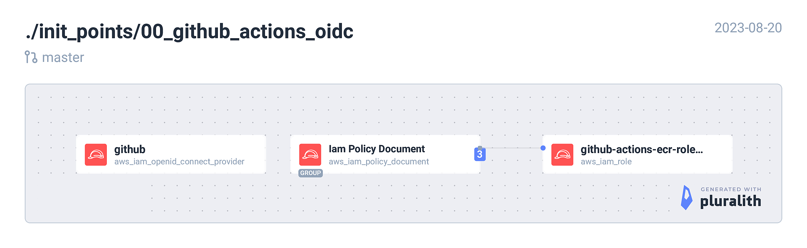

<!-- BEGIN_TF_DOCS -->
## Requirements

| Name | Version |
|------|---------|
|  [terraform](#requirement\_terraform) | = 1.5.1 |
|  [aws](#requirement\_aws) | ~> 5.5.0 |

## Providers

| Name | Version |
|------|---------|
|  [aws](#provider\_aws) | 5.5.0 |

## Modules

No modules.

## Resources

| Name | Type |
|------|------|
| [aws_iam_openid_connect_provider.github](https://registry.terraform.io/providers/hashicorp/aws/latest/docs/resources/iam_openid_connect_provider) | resource |
| [aws_iam_policy.iam_get_policy](https://registry.terraform.io/providers/hashicorp/aws/latest/docs/resources/iam_policy) | resource |
| [aws_iam_role.github_actions](https://registry.terraform.io/providers/hashicorp/aws/latest/docs/resources/iam_role) | resource |
| [aws_iam_policy_document.github_actions_ecr](https://registry.terraform.io/providers/hashicorp/aws/latest/docs/data-sources/iam_policy_document) | data source |
| [aws_iam_policy_document.github_actions_oidc](https://registry.terraform.io/providers/hashicorp/aws/latest/docs/data-sources/iam_policy_document) | data source |
| [aws_iam_policy_document.iam_get_poldoc](https://registry.terraform.io/providers/hashicorp/aws/latest/docs/data-sources/iam_policy_document) | data source |

## Inputs

| Name | Description | Type | Default | Required |
|------|-------------|------|---------|:--------:|
|  [region](#input\_region) | AWS region. e.g. eu-west-1 | `string` | n/a | yes |

## Outputs

| Name | Description |
|------|-------------|
|  [iam\_role\_arn](#output\_iam\_role\_arn) | ## This arn is used in github for authorisation |
<!-- END_TF_DOCS -->