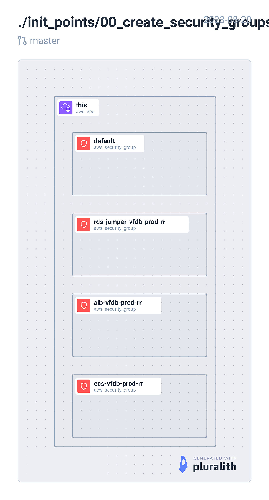

<!-- BEGIN_TF_DOCS -->
## Requirements

| Name | Version |
|------|---------|
|  [terraform](#requirement\_terraform) | = 1.5.1 |
|  [aws](#requirement\_aws) | ~> 5.5.0 |

## Providers

| Name | Version |
|------|---------|
|  [aws](#provider\_aws) | 5.5.0 |

## Modules

| Name | Source | Version |
|------|--------|---------|
|  [ecs\_service\_sg](#module\_ecs\_service\_sg) | ../../local_modules/security_groups/security_group | n/a |
|  [sg\_alb](#module\_sg\_alb) | ../../local_modules/security_groups/security_group | n/a |
|  [sg\_alb\_r1](#module\_sg\_alb\_r1) | ../../local_modules/security_groups/security_group_rule_cidr | n/a |
|  [sg\_alb\_r2](#module\_sg\_alb\_r2) | ../../local_modules/security_groups/security_group_rule_cidr | n/a |
|  [sg\_alb\_r3](#module\_sg\_alb\_r3) | ../../local_modules/security_groups/security_group_rule_source_sg | n/a |
|  [sg\_alb\_r4](#module\_sg\_alb\_r4) | ../../local_modules/security_groups/security_group_rule_source_sg | n/a |
|  [sg\_ecs\_r1](#module\_sg\_ecs\_r1) | ../../local_modules/security_groups/security_group_rule_source_sg | n/a |
|  [sg\_ecs\_r1b](#module\_sg\_ecs\_r1b) | ../../local_modules/security_groups/security_group_rule_source_sg | n/a |
|  [sg\_ecs\_r1c](#module\_sg\_ecs\_r1c) | ../../local_modules/security_groups/security_group_rule_source_sg | n/a |
|  [sg\_ecs\_r2](#module\_sg\_ecs\_r2) | ../../local_modules/security_groups/security_group_rule_source_sg | n/a |
|  [sg\_ecs\_r2b](#module\_sg\_ecs\_r2b) | ../../local_modules/security_groups/security_group_rule_source_sg | n/a |
|  [sg\_ecs\_r2c](#module\_sg\_ecs\_r2c) | ../../local_modules/security_groups/security_group_rule_source_sg | n/a |
|  [sg\_ecs\_r3](#module\_sg\_ecs\_r3) | ../../local_modules/security_groups/security_group_rule_source_sg | n/a |
|  [sg\_ecs\_r3b](#module\_sg\_ecs\_r3b) | ../../local_modules/security_groups/security_group_rule_source_sg | n/a |
|  [sg\_ecs\_r3c](#module\_sg\_ecs\_r3c) | ../../local_modules/security_groups/security_group_rule_source_sg | n/a |
|  [sg\_ecs\_r4](#module\_sg\_ecs\_r4) | ../../local_modules/security_groups/security_group_rule_source_sg | n/a |
|  [sg\_ecs\_r4c](#module\_sg\_ecs\_r4c) | ../../local_modules/security_groups/security_group_rule_source_sg | n/a |

## Resources

| Name | Type |
|------|------|
| [aws_security_group.default](https://registry.terraform.io/providers/hashicorp/aws/latest/docs/data-sources/security_group) | data source |
| [aws_vpc.this](https://registry.terraform.io/providers/hashicorp/aws/latest/docs/data-sources/vpc) | data source |

## Inputs

| Name | Description | Type | Default | Required |
|------|-------------|------|---------|:--------:|
|  [env](#input\_env) | Deployment environment. e.g. dev, uat, prod | `string` | n/a | yes |
|  [product](#input\_product) | Product name. e.g. scaps | `string` | n/a | yes |
|  [region](#input\_region) | AWS region. e.g. eu-west-1 | `string` | n/a | yes |
|  [vpc\_id](#input\_vpc\_id) | AWS VPC ID. e.g. vpc-9op489p4e66e05588 | `string` | n/a | yes |

## Outputs

| Name | Description |
|------|-------------|
|  [ecs\_alb\_sg\_id](#output\_ecs\_alb\_sg\_id) | n/a |
|  [ecs\_service\_sg\_id](#output\_ecs\_service\_sg\_id) | n/a |
<!-- END_TF_DOCS -->