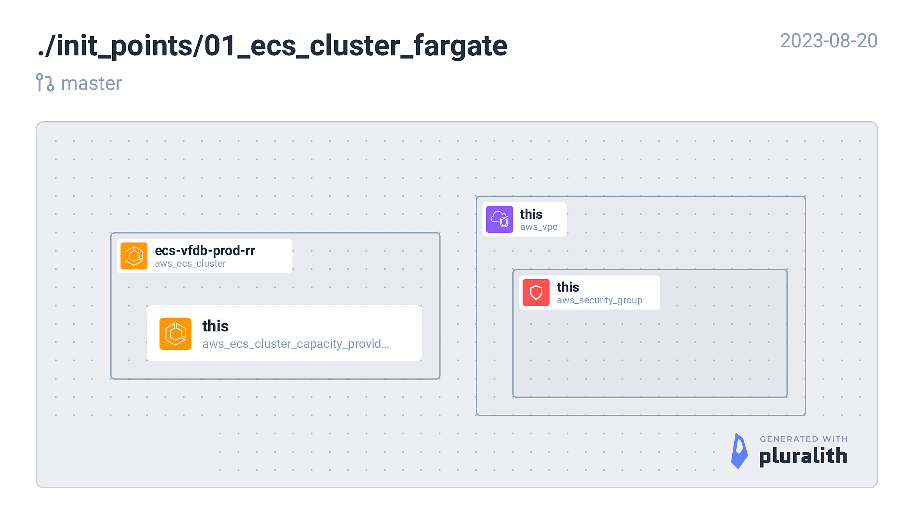

<!-- BEGIN_TF_DOCS -->
## Requirements

| Name | Version |
|------|---------|
|  [terraform](#requirement\_terraform) | = 1.5.1 |
|  [aws](#requirement\_aws) | ~> 5.5.0 |

## Providers

| Name | Version |
|------|---------|
|  [aws](#provider\_aws) | 5.5.0 |

## Modules

| Name | Source | Version |
|------|--------|---------|
|  [ecs\_cluster](#module\_ecs\_cluster) | terraform-aws-modules/ecs/aws//modules/cluster | 5.2.0 |

## Resources

| Name | Type |
|------|------|
| [aws_security_group.this](https://registry.terraform.io/providers/hashicorp/aws/latest/docs/data-sources/security_group) | data source |
| [aws_subnets.private](https://registry.terraform.io/providers/hashicorp/aws/latest/docs/data-sources/subnets) | data source |
| [aws_vpc.this](https://registry.terraform.io/providers/hashicorp/aws/latest/docs/data-sources/vpc) | data source |

## Inputs

| Name | Description | Type | Default | Required |
|------|-------------|------|---------|:--------:|
|  [env](#input\_env) | Deployment environment. e.g. dev, uat, prod | `string` | n/a | yes |
|  [instance\_type](#input\_instance\_type) | EC2 Instance type for ECS cluster. e.g. t3a.medium | `string` | n/a | yes |
|  [product](#input\_product) | Product name. e.g. scaps | `string` | n/a | yes |
|  [region](#input\_region) | AWS region. e.g. eu-west-1 | `string` | n/a | yes |
|  [vpc\_id](#input\_vpc\_id) | AWS VPC ID. e.g. vpc-9op489p4e66e05588 | `string` | n/a | yes |

## Outputs

| Name | Description |
|------|-------------|
|  [autoscaling\_capacity\_providers](#output\_autoscaling\_capacity\_providers) | n/a |
|  [ecs\_cluster\_arn](#output\_ecs\_cluster\_arn) | n/a |
|  [ecs\_cluster\_name](#output\_ecs\_cluster\_name) | n/a |
<!-- END_TF_DOCS -->