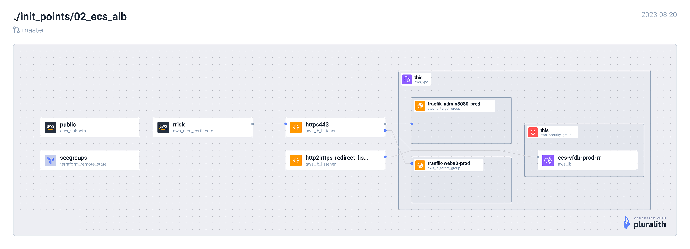

<!-- BEGIN_TF_DOCS -->
## Requirements

| Name | Version |
|------|---------|
|  [terraform](#requirement\_terraform) | = 1.5.1 |
|  [aws](#requirement\_aws) | ~> 5.5.0 |

## Providers

| Name | Version |
|------|---------|
|  [aws](#provider\_aws) | 5.5.0 |
|  [terraform](#provider\_terraform) | n/a |

## Modules

| Name | Source | Version |
|------|--------|---------|
|  [alb](#module\_alb) | ../../local_modules/ec2/alb/alb | n/a |
|  [target\_group\_traefik\_admin8080](#module\_target\_group\_traefik\_admin8080) | ../../local_modules/ec2/target_group | n/a |
|  [target\_group\_traefik\_web80](#module\_target\_group\_traefik\_web80) | ../../local_modules/ec2/target_group | n/a |

## Resources

| Name | Type |
|------|------|
| [aws_lb_listener.http2https_redirect_listner](https://registry.terraform.io/providers/hashicorp/aws/latest/docs/resources/lb_listener) | resource |
| [aws_lb_listener.https443](https://registry.terraform.io/providers/hashicorp/aws/latest/docs/resources/lb_listener) | resource |
| [aws_lb_listener_rule.webapp_subdomain](https://registry.terraform.io/providers/hashicorp/aws/latest/docs/resources/lb_listener_rule) | resource |
| [aws_lb_listener_rule.webapp_subdomain](https://registry.terraform.io/providers/hashicorp/aws/latest/docs/resources/lb_listener_rule) | resource |
| [aws_acm_certificate.scaps](https://registry.terraform.io/providers/hashicorp/aws/latest/docs/data-sources/acm_certificate) | data source |
| [aws_security_group.this](https://registry.terraform.io/providers/hashicorp/aws/latest/docs/data-sources/security_group) | data source |
| [aws_subnets.public](https://registry.terraform.io/providers/hashicorp/aws/latest/docs/data-sources/subnets) | data source |
| [aws_vpc.this](https://registry.terraform.io/providers/hashicorp/aws/latest/docs/data-sources/vpc) | data source |
| [terraform_remote_state.secgroups](https://registry.terraform.io/providers/hashicorp/terraform/latest/docs/data-sources/remote_state) | data source |

## Inputs

| Name | Description | Type | Default | Required |
|------|-------------|------|---------|:--------:|
|  [env](#input\_env) | Deployment environment. e.g. dev, uat, prod | `string` | n/a | yes |
|  [product](#input\_product) | Product name. e.g. scaps | `string` | n/a | yes |
|  [region](#input\_region) | AWS region. e.g. eu-west-1 | `string` | n/a | yes |
|  [scaps\_subdomain](#input\_scaps\_subdomain) | Route53 webapp subdomain | `string` | n/a | yes |
|  [traefik\_admin\_subdomain](#input\_traefik\_admin\_subdomain) | Route53 webapp subdomain | `string` | n/a | yes |
|  [traefik\_health\_check](#input\_traefik\_health\_check) | Traefik ping HealthCheck Map - 8082 | `map(string)` | <pre>{   "enabled": "true",   "healthy_threshold": "4",   "interval": "30",   "matcher": "200",   "path": "/ping",   "port": "8082",   "protocol": "HTTP",   "timeout": "20",   "unhealthy_threshold": "2" }</pre> | no |
|  [traefik\_health\_check\_admin](#input\_traefik\_health\_check\_admin) | Traefik rawdata HealthCheck Map - 8080 | `map(string)` | <pre>{   "enabled": "true",   "healthy_threshold": "4",   "interval": "30",   "matcher": "200-499",   "path": "/api/rawdata",   "port": "8080",   "protocol": "HTTP",   "timeout": "20",   "unhealthy_threshold": "10" }</pre> | no |
|  [vpc\_id](#input\_vpc\_id) | AWS VPC ID. e.g. vpc-9op489p4e66e05588 | `string` | n/a | yes |

## Outputs

| Name | Description |
|------|-------------|
|  [alb\_arn](#output\_alb\_arn) | n/a |
|  [alb\_dns\_name](#output\_alb\_dns\_name) | n/a |
|  [alb\_name](#output\_alb\_name) | n/a |
|  [target\_group\_traefik\_admin8080\_arn](#output\_target\_group\_traefik\_admin8080\_arn) | n/a |
|  [target\_group\_traefik\_web80\_arn](#output\_target\_group\_traefik\_web80\_arn) | n/a |
<!-- END_TF_DOCS -->