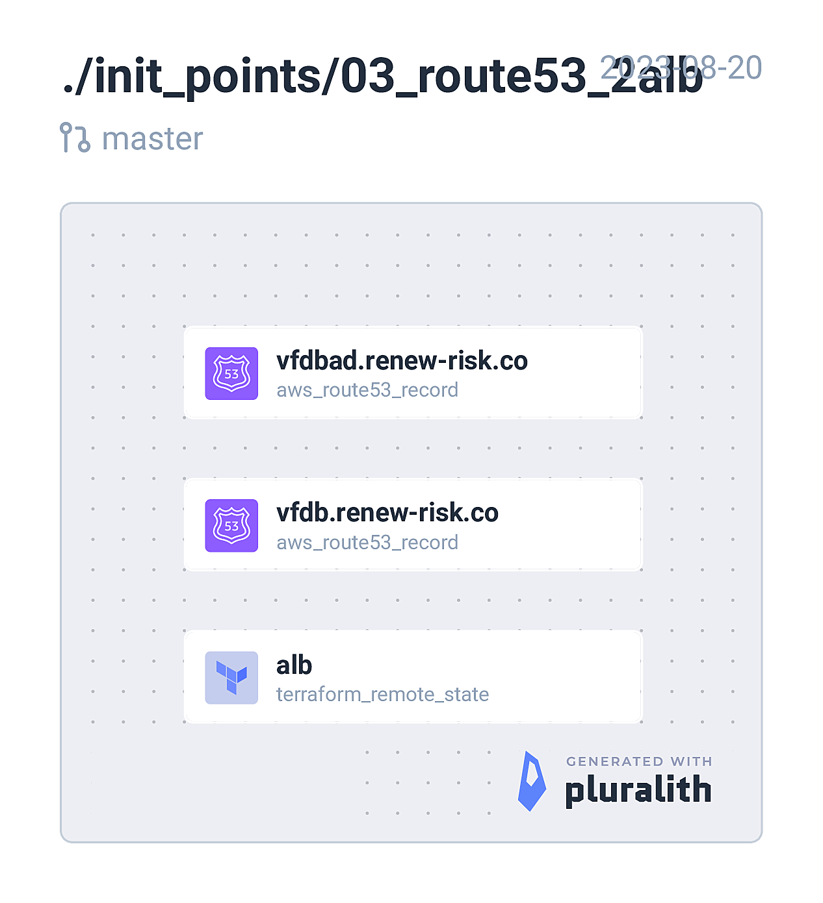

<!-- BEGIN_TF_DOCS -->
## Requirements

| Name | Version |
|------|---------|
|  [terraform](#requirement\_terraform) | = 1.5.1 |
|  [aws](#requirement\_aws) | ~> 5.5.0 |

## Providers

| Name | Version |
|------|---------|
|  [aws](#provider\_aws) | 5.5.0 |
|  [terraform](#provider\_terraform) | n/a |

## Modules

No modules.

## Resources

| Name | Type |
|------|------|
| [aws_route53_record.ecs_scaps](https://registry.terraform.io/providers/hashicorp/aws/latest/docs/resources/route53_record) | resource |
| [aws_route53_record.ecs_traefik_admin](https://registry.terraform.io/providers/hashicorp/aws/latest/docs/resources/route53_record) | resource |
| [terraform_remote_state.alb](https://registry.terraform.io/providers/hashicorp/terraform/latest/docs/data-sources/remote_state) | data source |

## Inputs

| Name | Description | Type | Default | Required |
|------|-------------|------|---------|:--------:|
|  [env](#input\_env) | Deployment environment. e.g. dev, uat, prod | `string` | n/a | yes |
|  [product](#input\_product) | Product name. e.g. scaps | `string` | n/a | yes |
|  [region](#input\_region) | AWS region. e.g. eu-west-1 | `string` | n/a | yes |
|  [scaps\_subdomain](#input\_scaps\_subdomain) | Route53 scaps subdomain | `string` | n/a | yes |
|  [traefik\_admin\_subdomain](#input\_traefik\_admin\_subdomain) | Route53 webapp subdomain | `string` | n/a | yes |
|  [ttl](#input\_ttl) | Route53 CNAME ttl | `number` | n/a | yes |

## Outputs

No outputs.
<!-- END_TF_DOCS -->