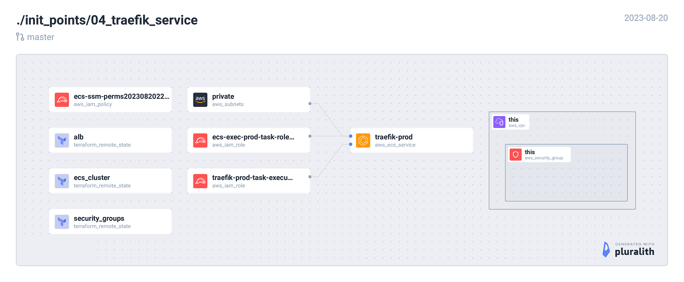

<!-- BEGIN_TF_DOCS -->
## Requirements

| Name | Version |
|------|---------|
|  [terraform](#requirement\_terraform) | = 1.5.1 |
|  [aws](#requirement\_aws) | ~> 5.5.0 |

## Providers

| Name | Version |
|------|---------|
|  [aws](#provider\_aws) | 5.5.0 |
|  [terraform](#provider\_terraform) | n/a |

## Modules

No modules.

## Resources

| Name | Type |
|------|------|
| [aws_ecs_service.this](https://registry.terraform.io/providers/hashicorp/aws/latest/docs/resources/ecs_service) | resource |
| [aws_ecs_task_definition.traefik](https://registry.terraform.io/providers/hashicorp/aws/latest/docs/resources/ecs_task_definition) | resource |
| [aws_iam_policy.ecs_ssm_exec](https://registry.terraform.io/providers/hashicorp/aws/latest/docs/resources/iam_policy) | resource |
| [aws_iam_policy.ecs_task_exec](https://registry.terraform.io/providers/hashicorp/aws/latest/docs/resources/iam_policy) | resource |
| [aws_iam_role.ecs_exec](https://registry.terraform.io/providers/hashicorp/aws/latest/docs/resources/iam_role) | resource |
| [aws_iam_role.traefik](https://registry.terraform.io/providers/hashicorp/aws/latest/docs/resources/iam_role) | resource |
| [aws_security_group.this](https://registry.terraform.io/providers/hashicorp/aws/latest/docs/data-sources/security_group) | data source |
| [aws_subnets.private](https://registry.terraform.io/providers/hashicorp/aws/latest/docs/data-sources/subnets) | data source |
| [aws_vpc.this](https://registry.terraform.io/providers/hashicorp/aws/latest/docs/data-sources/vpc) | data source |
| [terraform_remote_state.alb](https://registry.terraform.io/providers/hashicorp/terraform/latest/docs/data-sources/remote_state) | data source |
| [terraform_remote_state.ecs_cluster](https://registry.terraform.io/providers/hashicorp/terraform/latest/docs/data-sources/remote_state) | data source |
| [terraform_remote_state.security_groups](https://registry.terraform.io/providers/hashicorp/terraform/latest/docs/data-sources/remote_state) | data source |

## Inputs

| Name | Description | Type | Default | Required |
|------|-------------|------|---------|:--------:|
|  [env](#input\_env) | Deployment environment. e.g. dev, uat, prod | `string` | n/a | yes |
|  [product](#input\_product) | Product name. e.g. scaps | `string` | n/a | yes |
|  [region](#input\_region) | AWS region. e.g. eu-west-1 | `string` | n/a | yes |
|  [traefik\_admin\_subdomain](#input\_traefik\_admin\_subdomain) | Route53 webapp subdomain | `string` | n/a | yes |
|  [traefik\_image](#input\_traefik\_image) | Traefik image. e.g. 334406042632.dkr.ecr.eu-west-1.amazonaws.com/traefik | `string` | n/a | yes |
|  [traefik\_tag](#input\_traefik\_tag) | Docker tag. e.g. 3.9.0 | `string` | n/a | yes |
|  [vpc\_id](#input\_vpc\_id) | AWS VPC ID. e.g. vpc-9op489p4e66e05588 | `string` | n/a | yes |

## Outputs

| Name | Description |
|------|-------------|
|  [ecs\_service\_name](#output\_ecs\_service\_name) | n/a |
<!-- END_TF_DOCS -->